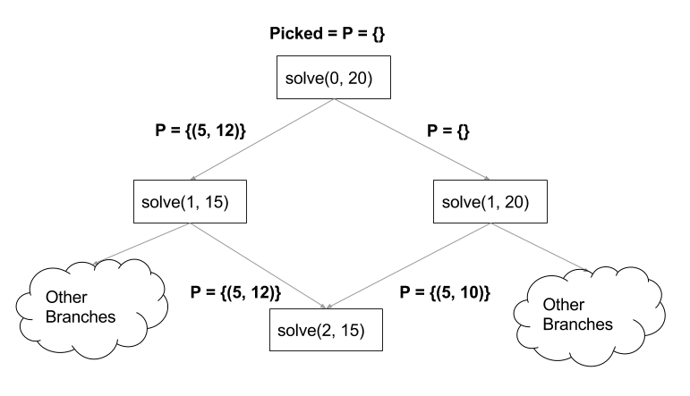

% Performance Aware Programming
% Paul Grigoras


## Last time

1. $Performance = {Wall Clock Time}^{-1}$

\pause

2. How to measure _Wall Clock Time_
    * `time`, `/usr/bin/time -v`
    * `java -Xprof`, `jvisualvm`
    * `System.currentTimeMillis()`, `System.nanoTime()`

\pause

3. How to run a simple benchmark and plot results
    * Write a script to automate (`bash`, `python`)
    * Plot with `gnuplot` (or `matplotlib`)

## Last Time - Matrix Multiply Loop Interchange

* Matrix multiply
```Java
for (int i = 0; i < n; i++)      // i
  for (int j = 0; j < n; j++)    // j
    for (int k = 0; k < n; k++)  // k
      c.data[i][j] += data[i][k] * other.data[k][j];
```

* Matrix multiply loop interchange
```Java
for (int i = 0; i < n; i++)       // i
  for (int k = 0; k < n; k++)     // k ---- swapped
    for (int j = 0; j < n; j++)   // j --|
      c.data[i][j] += data[i][k] * other.data[k][j];
```

## Last Time - Matrix Multiply Loop Interchange


## Last Time - Matrix Multiply Loop Interchange

* This is incredible:
    * both routines perform exactly the same operations
    * still, the loop interchanged version is up to 10X faster...
    * clearly we can't explain this at the _language_ level

*  If you don't know why...
\pause
*  ... or don't know a _second_ reason why
\pause
*  __come to Lecture 3__

## This time - Algorithms

\begin{columns}
    \column{.40\textwidth}
    \begin{figure}
      \includegraphics[]{img/skiena.jpg}\\
    \end{figure}
    Steven Skiena -- \emph{The Algorithm Design Manual}
    \column{.45\textwidth}
    \begin{figure}
      \includegraphics[]{img/algorithms.jpg}\\
    \end{figure}
    Thomas Cormen et al. -- \emph{Introduction to Algorithms}
\end{columns}

# The Problem

## The Discrete Knapsack Problem

__Given__

1. a list of items (I) with weights ($W_i$) and profits ($P_i$)
2. a backpack with a limited weight capacity ($W_{max}$),

_Maximise the profit achieved by fitting items into the backpack._

\pause

* Mathematically, maximise $\sum P_j$ subject to $\sum W_j <= W_{max}$

\pause

__Note__

1. Not allowed to split an item (hence __discrete__ knapsack).

2. Each item can only be used once.

## The Discrete Knapsack Problem - Example

* Assume $W_{max} = 12$

* I = {($W_i, P_i$)} = {(5, 12), (5, 10), (6, 11)}

* Then the maximum profit is __23__
    * Pick first and last item

* Seems simple enough, how do we solve it?

# Solution I - Correct, but slooow...

## Complete Search


* When you have no idea what to do... do a _complete search_


## Complete Search

* As the name suggests...
\pause
* ...CS explores the _entire space of possible solutions_ to find the
  best one
     * it is definitely __correct__...
     * but can also be __very slow__
\pause
*
```Java
for (Solution sol : generate_all_solutions())
  if (sol.check())
      sol.print()
```


## Complete Search - Recursive, with pruning

* Recursive with pruning
*
```Java
void search(Solution sol)
  if (sol.reject()) return;
  if (sol.check())  sol.print();
  for (Node n : valid_next_nodes(sol)):
    search(new Solution(sol, node))
```
\pause
* `sol.reject()` may discard an entire solution sub-tree, for which it
  would be impossible to obtain a valid solution

* Let's see how this would work for knapsack...

## Complete Search For Discrete Knapsack

* Assume $W_{max} = 12$, items as below ($W_i, P_i$)


\begin{table}[h]
\begin{tabular}{llll}
Items  & Picked &   Wcurrent &   Profit \\
\hline
  No &             &   0 &         0 \\
(5, 12) \\
(5, 10) \\
(6, 11) \\
\end{tabular}
\end{table}


* Best_profit = ??


## Complete Search For Discrete Knapsack

* Assume $W_{max} = 12$, items as below ($W_i, P_i$)


\begin{table}[h]
\begin{tabular}{llll}
Items  & Picked &   Wcurrent &   Profit \\
\hline
  No &             &   0 &         0 \\
(5, 12) & 1 & 5 & 12  \\
(5, 10) \\
(6, 11) \\
\end{tabular}
\end{table}


* Best_profit = ??


## Complete Search For Discrete Knapsack

* Assume $W_{max} = 12$, items as below ($W_i, P_i$)


\begin{table}[h]
\begin{tabular}{llll}
Items  & Picked &   Wcurrent &   Profit \\
\hline
  No &             &   0 &         0 \\
(5, 12) & 1 & 5 & 12  \\
(5, 10) & 1 & 10 & 22 \\
(6, 11) \\
\end{tabular}
\end{table}


* Best_profit = ??

## Complete Search For Discrete Knapsack

* Assume $W_{max} = 12$, items as below ($W_i, P_i$)


\begin{table}[h]
\begin{tabular}{llll}
Items  & Picked &   Wcurrent &   Profit \\
\hline
  No &             &   0 &         0 \\
(5, 12) & 1 & 5 & 12  \\
(5, 10) & 1 & 10 & 22 \\
(6, 11) & 0 & 10 & 22 \\
\end{tabular}
\end{table}


* Best_profit = 22


## Complete Search For Discrete Knapsack

* Assume $W_{max} = 12$, items as below ($W_i, P_i$)


\begin{table}[h]
\begin{tabular}{llll}
Items  & Picked &   Wcurrent &   Profit \\
\hline
  No &             &   0 &         0 \\
(5, 12) & 1 & 5 & 12  \\
(5, 10) & 1 & 10 & 22 \\
(6, 11)  \\
\end{tabular}
\end{table}


* Best_profit = 22

## Complete Search For Discrete Knapsack

* Assume $W_{max} = 12$, items as below ($W_i, P_i$)


\begin{table}[h]
\begin{tabular}{llll}
Items  & Picked &   Wcurrent &   Profit \\
\hline
  No &             &   0 &         0 \\
(5, 12) & 1 & 5 & 12  \\
(5, 10) & 0 & 5 & 12 \\
(6, 11)  \\
\end{tabular}
\end{table}


* Best_profit = 22


## Complete Search For Discrete Knapsack

* Assume $W_{max} = 12$, items as below ($W_i, P_i$)


\begin{table}[h]
\begin{tabular}{llll}
Items  & Picked &   Wcurrent &   Profit \\
\hline
  No &             &   0 &         0 \\
(5, 12) & 1 & 5 & 12  \\
(5, 10) & 0 & 5 & 12 \\
(6, 11) & 1 & 11 & 23  \\
\end{tabular}
\end{table}


* Best_profit = ~~22~~ __23__

## Complete Search - Discrete Knapsack

1. What is a possible solution?
    * A subset of I

\pause

2. When do we reject a solution ?
    * When $W_{current} > W_{max}$

\pause


3. What are the valid_next_nodes ?
    * Next unused item(s)

\pause

4. When is a solution optimal?
    * We only know at the very end...


## Complete Search - Discrete Knapsack Recursive

```Java
double solve(int [] w, int [] p, int i, int weight) {

  // terminate when we have no more items to use
  // or no more spare capacity
  if (i == 0 || weight == 0) return 0;

  // if the current item weighs more than our capacity
  //   don't use it
  if (w[i] > weight)
     return solve(w, p, i - 1, weight);

  // else pick the best profit option
  //   between using and not using this item
  return max(solve(w, p, i - 1, weight),
             solve(w, p, i - 1, weight - w[i]) + p[i]);
}
```

##


##


<!-- ## Complete Search - Discrete Knapsack -->

<!-- * This is solution is correct (modulo implementation bugs) -->
<!-- * But how fast is it? -->
<!-- * TODO plots -->

# Correct (Done). Optimise!

## Optimising

* We can see that for a relatively small number of items our solution
  is _extremely slow_

\pause

* Ideas for optimisation
    * Is there some redundant computation we can eliminate?
    * Is there some operation we can perform more efficiently?

\pause

* Let's have a closer look at the _sub-problems_ we are solving...

## Optimising - Overlapping problems

* How could there be _redundant_ computation?

\pause

* We are solving this recurrence relation
```
solve(i, s) = max(solve(i - 1, s),
                  solve(i - 1, s - w[i]) + p[i])
```

\pause

* Overlapping problems occur if at any point we get to the same item
    * with the same spare capacity
    * but through a different path

## Optimising - Overlapping problems

* $W_{max} = 20$, I = {(5, 12), (5, 10), (6, 11), (4, 20), (5, 5)}


\pause

* We can _cache_ overlapping problems

<!-- ## Optimising - A note on recursion -->

<!-- * Recursive solutions tend to be slow(ish) -->
<!-- * Unless the recursion is obviously tail-recursive, some compilers may -->

## Performance Comparison

* Dynamic Programming - Pros
    * considerably fewer function calls
    * considerably faster

\pause

* Dynamic Programming - Cons
    * a bit more challenging to develop
    * restricted by maximum problem size
    * effectively we are trading _space_ for _compute time_
    * for knapsack, we could do _much better_ in terms of _space_ by
      using a bottom up (instead of a top down) approach

\pause

* Moral of the Story: better algorithms are _awesome_
    * CS --$O(2^n)$ vs DP -- $O(n * w)$

## Algorithms

\begin{columns}
    \column{.40\textwidth}
    \begin{figure}
      \includegraphics[]{img/skiena.jpg}\\
    \end{figure}
    Steven Skiena -- \emph{The Algorithm Design Manual}
    \column{.45\textwidth}
    \begin{figure}
      \includegraphics[]{img/algorithms.jpg}\\
    \end{figure}
    Thomas Cormen et al. -- \emph{Introduction to Algorithms}
\end{columns}

## Follow Up

* Making programs run faster on your own can be depressing

* Fortunately, there are many online communities:
    * __UVA Online__ \url{http://uhunt.felix-halim.net/}
    * __Codeforces__  \url{http://codeforces.com/}
    * __Hackerrank__ \url{https://www.hackerrank.com/}
    * __Project Euler__ \url{https://projecteuler.net/}

* For an intro on useful algorithms see last year's AP notes
    * \url{https://github.com/paul-g/brabble}

## Next Time

* We delve deeper into the hardware side
    * Caches
    * Vectorization
    * Branch prediction

##

\begin{columns}
    \column{.65\textwidth}
    \begin{figure}
      \includegraphics[]{img/no-questions.jpg}\\
    \end{figure}
\end{columns}
