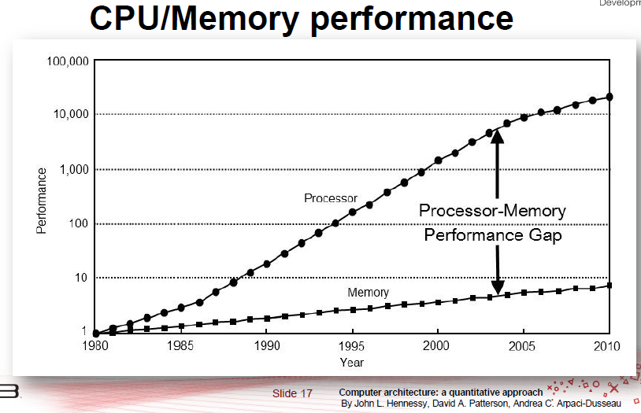

% Performance Aware Programming
% Paul Grigoras


## Last Time

\scriptsize

```
 n           Class               Result     Took(ms)       Calls
---          -----               ------     --------       -----
 60         CompleteSearch        254       5267     1842695079
 60   CompleteSearchPruned        254       4976     1613439769
 60             MemoSolver        254          1           2689
 60         BottomUpSolver        254          1           2950
-----------------------------------------------------------------
 70         CompleteSearch        285      39796    14206301293
 70   CompleteSearchPruned        285      36663    12132555911
 70             MemoSolver        285          1           3189
 70         BottomUpSolver        285          0           3450
```

\normalsize

## Last Time

* Better algorithms make a huge difference!

\pause

* What about better hardware?

## Hardware Over Time

* You might be tempted to think algorithms are king...

\pause

* ... but think about how much hardware has improved over time

## Transistor Count Over Time


## Memory CPU Gap



## This Time

* We will look at a few hardware features with high impact on
  performance: _caches_ and _vectorization_

\pause

*  __PROGRAMMER__ -- _Shouldn't the compiler do this for me?_

\pause

* ... some _good_ compilers (gcc, icc) do (in _some_ cases)
* But what if:
    * Interpreted languages (Python, JavaScript)
    * New languages (bad(_ish_) compilers)
    * Just In Time Compiled (JIT) languages
    * You know more about your application than the compiler
* Even for languages that have been standard for ages (e.g. Java) we
  can help the compiler generate better code

# 1. Caches

## The Memory Hierarchy

* Our sytems are composed of:
    * cheap and slow memory: magnetic tape, disks, ssds, DRAM
    * fast and expensive memory: L1-3 caches, CPU registers

\pause

* These form a _hierarchy_:
    * The higher in the hierarchy the faster and smaller
    * If used correctly, provides the _illusion_ of fast & large memory
    * But read/write performance at different levels may vary by a _few
      orders of magnitude_

\pause

* It is important to use our memory hierarchy well...

## Caches

* Caches are fast memory used to store _frequently reused_ data
* _Caching_ is common in both hardware and algorithm design
    * We saw Dynamic Programming makes use of caching
    * Almost all computers today have some form of cache

* Generally, caches are organised in rows, each row containing one or
  more words

* In practice, the design of a cache may be quite elaborate:
    * Replacement policy, Pre-fetching, Associativity, Number of levels etc.

## Caches -- A Simple Model

* We can do well with a simple model of the cache
    * It has R rows, each row stores K words
    * The width of a word is 8 bytes (double precision)
    * Initially the cache is empty

* A _cache miss_ occurs when you do not have the data for the particular
  address in the cache

* On miss, we fetch the block containing the requested address


## Cache Example


## Cache Example


## Cache Example


## Cache Example


## Cache Example


## Cache Example


## Caches

* Reading data from cache is much faster than from memory
* Minimizing the number of cache misses is _good_

* Modern CPUs can optimise sequential read/write access
    * Data prefetch on linear access pattern

* Caches are managed by hardware/OS (so they are fast)

\pause

* As a programmer you don't ever know you have a cache...

\pause

* ... or do you?

## Word of Caution

* Before we proceed, a word of caution
* When optimising applications it is good to have
    * A model of the expected performance improvement
    * A relevant benchmark
    * Means of _measuring_ the performance improvement
    * Tools to drill down and understand what goes wrong when the
      _observed_ results do not match the _expected_ results

* Let's proceed to matrix multiply...


# 1.1 Model

## Matrix Multiply Naive vs Loop Interchanged -- Model

\scriptsize

```Java
for (int i = 0; i < n; i++)      // i
  for (int j = 0; j < n; j++)    // j
    for (int k = 0; k < n; k++)  // k
      c[i][j] += a[i][k] * b[k][j];
```

```Java
for (int i = 0; i < n; i++)       // i
  for (int k = 0; k < n; k++)     // k ---- swapped
    for (int j = 0; j < n; j++)   // j --|
      c[i][j] += a[i][k] * b[k][j];
```

\normalsize

\pause


<!-- ## Matrix Multiply -->

<!--  -->

## Matrix Multiply -- L1 Cache Model

* Miss rate on accesses to the B matrix:
     * $N^2$ for naive version
     * $N^2/K$ for interchanged version
* The cache line length is 64 Bytes --> K = 8 (double values)
* So loop interchanged
should be roughly _8 times faster_?

\pause

* Not quite, this is diminished by the proportion of time we spend
  accessing the B matrix

## Matrix Multiply -- L1 Cache Model

* We also need to take into account that a penalty for miss
increases substantially as we descend in the cache hierarchy: a
L1 cache miss is ~ 10 cycles, a LL cache miss is ~ 200 cycles

* We could spend a week trying to account for all the factors (and
probably should, if we were doing this for a living) but for now
let's just run the thing!

* We can _reasonably expect_ our interchanged version to be a few
times faster than the naive version


## Matrix Multiply -- Other Cache Model

* We'll ignore L2 for now

* What about LL cache?
    * The cache is quite large (3 MB on my machine)
    * But our benchmark is significantly larger:
        * 3, 1024 x 1024, double precision matrices = 24 MB
    * So what should we expect?

# 1.2 Benchmark

##


# 1.3 Tools

## Observing Cache Performance

* Cachegrind \url{http://valgrind.org/docs/manual/cg-manual.html}
* Usage
```
valgrind --tool=cachegrind <program>
```
\pause
* Used for cache and branch prediction _simulation_
* A simple model of L1 and LL cache
    * can read properties from
      `/sys/devices/system/cpu/cpu*/cache/index*/`

## Cachegrind Output Explained

* Cachegrind models the CPU Cache as:
     * Separate L1 data and instruction caches
     * One larger last level (LL) cache
* Cachegrind reports for each:
     * the total number of instructions (refs)
     * the number of misses (misses)
     * and the miss rate (misses / reffs)
     * it also shows a breakdown of read (rd) and write (wr)


## Cachegrind -- Naive vs Interchanged

\scriptsize

```
D   refs:       5,602,482,256  (4,476,479,899 rd   + 1,126,002,357 wr)
D1  misses:     2,357,566,112  (2,353,550,896 rd   +     4,015,216 wr)
LLd misses:        16,898,948  (   16,095,212 rd   +       803,736 wr)
D1  miss rate:           42.0% (         52.5%     +           0.3%  )
LLd miss rate:            0.3% (          0.3%     +           0.0%  )
```

```
D   refs:      4,533,066,541  (3,408,167,562 rd   + 1,124,898,979 wr)
D1  misses:      140,352,144  (  136,360,317 rd   +     3,991,827 wr)
LLd misses:       14,884,614  (   14,123,898 rd   +       760,716 wr)
D1  miss rate:           3.0% (          4.0%     +           0.3%  )
LLd miss rate:           0.3% (          0.4%     +           0.0%  )
```

\normalsize

* L1 data miss rate is 10 times smaller!!!

## Matrix Multiply - Last Level Miss Rate

* The last level miss rate is incredibly small. Why?

\pause

* We only need to cache a small proportion of each matrix

* $KN$ values = $64 * 1024$ B = $64$ KB
   * Too large for L1 (32K)
   * But small enough for L3 (3MB)

## Performance Improvement


* Interchanged is around 10x faster for larger matrices.

\pause

* Could anything else explain the performance improvement?


# 2. Vectorization

## Vectorization

* Many current CPUs have hardware support for _vectorization_

* This provides special instructions which perform the same _operation_ on _multiple data inputs_

* Current architectures support 256 bit wide vector instructions

* Can perform 8 single precision (or 4 double precision) floating point instructions simultaneously

* Many current compilers understand this and can optimise your code -- _vectorizing compilers_


## Vectorization - Example


## Wait - does Java know about Vectorization?

\begin{columns}
    \column{\textwidth}
    \begin{figure}
    \includegraphics[]{img/java.png}\\
    \end{figure}
\end{columns}

\pause

* _Bytecode_ is supposed to be _architecture_ independent
    * Is it vectorised?
* If not, will the JIT Compiler be able to vectorise the _bytecode_,
  at runtime?
* How can we observe this?

## A look at the Bytecode

* You can see the generated bytecode by running:
```
javap <className>
```

* We want to look at the `Matrix` class:
```
javap  Matrix
```

\pause

* Bytecode doesn't know about vectorization (makes sense)
* The entire list of byte code instructions is here:
\url{http://en.wikipedia.org/wiki/Java_bytecode_instruction_listings}
* But, the JVM compiles bytecode to _native_ code...

## Setting up for Native Code

* To see the native code we need to install a JVM plugin for
  disassembling byte code instructions

* You can get it from \url{https://github.com/drazzib/openjdk-hsdis}

* Follow instructions and install it (__OpenJDK 7 Only__)

\pause

* Now print the native code with\scriptsize\
```
java -XX:UnlockDiagnosticVMOptions -XX:+PrintAssembly <program>
```

\normalsize

## A look at the Native Code

* The native code will be in x64 assembly language

* If you run this on a recent CPU, native code will contain some
  vector instructions:

     * SSE - Streaming SIMD Extension
     * AVX - Advanced Vector Extension
     * \url{http://www.intel.com/content/www/us/en/processors/architectures-software-developer-manuals.html}

* _check_ if your CPU supports AVX
```
grep avx /proc/cpuinfo
```

\pause


## The Native Code -- Naive vs Loop Interchanged

* It seems that the JIT compiler
     * knows about vector instructions (_cool_)
     * is able to optimise better for the interchanged version
     * why?

     \pause

     * for efficient vectorisation operands must be in contiguous
       memory locations
     * \url{https://software.intel.com/sites/products/documentation/doclib/iss/2013/compiler/cpp-lin/GUID-32ED933F-5E8A-4909-A581-4E9DB59A6933.htm}

## Summary

* We can re-write code to help the compiler make better use of the
  memory hierarchy and CPU architecture
* This can result in substantial performance improvement
* To optimise efficiently we need to think carefully about the
  underlying hardware

\pause

* Disclaimer: __Premature optimisation is the root of all evil__ (_Structured Programming with Go To Statements_, D. Knuth)

* Your program should be _correct_ and _elegant_ before it is _fast_

<!-- ## Resources -->

<!-- ## Next Time -->
