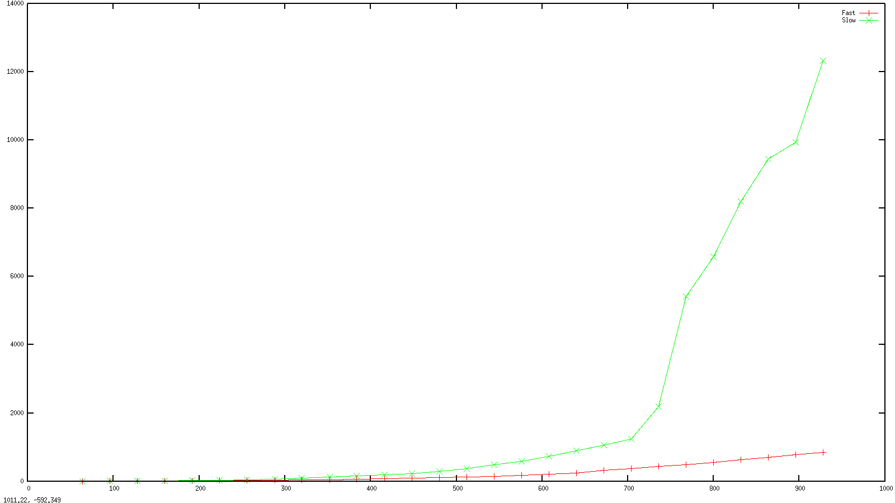

% Performance Aware Programming
% Paul Grigoras


## Last Time

* Better algorithms make a huge difference!

\pause

* What about the hardware?

## Hardware Over Time

* You might be tempted to think algorithms are king...
* ... but think about how much our hardware has improved over time

## Transistor Count Over Time


## CPU Frequency Over Time


## This Time

* We will look at a few hardware features with a high impact on the
  performance of (some) applications:
    * caches
    * vectorization

* You may be tempted to say _The compiler should do this for me..._
* and some good compilers do
* But what if
    * Interpreted languages
    * New languages (bad(_ish_) compilers)
    * Compiler bugs
    * Just In Time Compiled (JIT)
* Even for languages that have been standard for ages (e.g. Java)
    * We can still use rather simple tricks to help the compiler
      generate better code

# Caches

## The Memory Hierarchy

* Our sytems are composed of cheap and slow memory
    * Magnetic tape, disks, ssds, DRAM
* Fast and expensive memory
    * L1-3 caches, CPU registers
* The performance for read/write at different levels may vary by a few
  orders of magnitude
* Hence, it is important to use our memory hierarchy well...

## Caches

* Caches are fast, but usually quite small
* Furthermore _caching_ is a fundamental technique in both hardware
  and algorithm design:
    * We saw Dynamic Programming makes use of caching
    * Almost all computers today have some form of cache

## Caches

* Generally, caches are organised in rows, each row containing one or
  more words

* In practice, the design of a cache may be quite elaborate. Things to consider:
    * Replacement policy
    * Pre-fetching
    * Associativity
    * Number of levels
    * Ensuring cache coherency between multiple processors (on
      multi-processor systems)

* However, we can do well with a simple model of the cache
    * It has R rows
    * Each row stores K words
    * The width of a word is 8 bytes (corresponding to double
      precision)
    * Initially the cache is empty
    * On a cache miss, we fetch the original address as well as the
      neighbouring K - 1 words

## Cache Example

## Caches

* reading data from cache is much faster than from memory..
* .. minimizing the number of cache misses can improve performance
* Which brings us back to...


* Modern CPUs can optimise sequential read/write access
    * Data prefetch on linear access pattern
* We should make use of this
* Improve locality (spatial and temporal)
* align code and data


## Word of Caution

* When dealing with this level of optimisations, it's good to have
    * A model of the expected performance improvement (_hypothesis_)
    * Some observation to (hopefully) confirm our hypothesis
        * Tools to _measure_ various parameters
        * Rough estimations

## Matrix Multiply



## Matrix Multiply

## Matrix Multiply

* Important kernel in many applications (machine learning, graphics,
  graph theory)

* It has great _computational intensity_ (number of ops / memory reference)
    * We should only need to read/write $3N^2$ words
    * We must perform $2N^3$ arithmetic operations
    * ops/ref = 2N / 3
    * for every byte moved we do a _very large_ number of operations
    * _compute bound_ application (as opposed to _memory bound_)

* This makes it a canonical example in compiler theory - many
optimisations can be applied to increase performance

## Matrix Multiply Naive vs Loop Interchanged -- Model

\scriptsize

```Java
for (int i = 0; i < n; i++)      // i
  for (int j = 0; j < n; j++)    // j
    for (int k = 0; k < n; k++)  // k
      c.data[i][j] += data[i][k] * other.data[k][j];
```

```Java
for (int i = 0; i < n; i++)       // i
  for (int k = 0; k < n; k++)     // k ---- swapped
    for (int j = 0; j < n; j++)   // j --|
      c.data[i][j] += data[i][k] * other.data[k][j];
```

\normalsize

\pause


## Matrix Multiply


## Matrix Multiply -- Small Scale Example

## Matrix Multiply -- L1 Cache Model

* The miss rate on the B matrix for Naive version should be N*N
* The miss rate for the loop interchanged version should be N*N/B
* The cache line length is 64 Bytes --> 8 Double
* So loop interchange should be roughly 8 times faster?
* Not quite, this is diminished by:
* The proportion of time we spend accessing the B matrix
* We also need to take into account that a penalty for miss
increases substantially as we descend in the cache hierarchy: a
L1 cache miss is (around) 10 cycles, a LL cache miss is (around)
200 cycles
* We could spend a week trying to account for all the factors (and
probably should, if we were doing this for a living) but for now
let's just run the thing!
* We can _reasonably expect_ our interchanged version to be a few
times faster than the naive version

## Matrix Multiply -- Other Cache Model

* We'll ignore L2 for now

* What about LL cache?
    * The cache is quite is quite large (3 MB on my machine, could be
      up to 20 - 40 MB on server class processors)
    * Our benchmark is rather small (3, 1024 x 1024 double matrices, = 12 MB)
    * In the LL cache
    *
    * We should have _very few misses_

## Observing Cache Performance

* Cachegrind http://valgrind.org/docs/manual/cg-manual.html
    * A tool provided as of the Valgrind project
    * Used for cache and branch prediction _simulation_
    * Usage
    ```
    valgrind --tool=cachegrind <program>
    ```

## Cachegrind Output Explained

* Cachegrind models the CPU Cache as:
     * Separate L1 data and instruction caches
     * One larger last level cache
* Cachegrind reports for each:
     * the total number of instructions (refs)
     * the number of misses (misses)
     * and the miss rate (misses / reffs)
     * it also shows a breakdown of read (rd) and write (wr)


<!-- ## cachegrind Example -->

<!-- ``` -->
<!-- → valgrind --tool=cachegrind java Measuring 1024 -s -->
<!-- ==19480== Cachegrind, a cache and branch-prediction profiler -->
<!-- ==19480== Copyright (C) 2002-2012, and GNU GPL'd, by Nicholas Nethercote et al. -->
<!-- ==19480== Using Valgrind-3.8.1 and LibVEX; rerun with -h for copyright info -->
<!-- ==19480== Command: java Measuring 1024 -s -->
<!-- ==19480== -->
<!-- --19480-- warning: L3 cache found, using its data for the LL simulation. -->
<!-- 1024 ==19480== -->
<!-- ==19480== I   refs:      12,361,048,671 -->
<!-- ==19480== I1  misses:         1,602,496 -->
<!-- ==19480== LLi misses:            64,559 -->
<!-- ==19480== I1  miss rate:           0.01% -->
<!-- ==19480== LLi miss rate:           0.00% -->
<!-- ==19480== -->
<!-- ==19480== D   refs:       5,602,482,256  (4,476,479,899 rd   + 1,126,002,357 wr) -->
<!-- ==19480== D1  misses:     2,357,566,112  (2,353,550,896 rd   +     4,015,216 wr) -->
<!-- ==19480== LLd misses:        16,898,948  (   16,095,212 rd   +       803,736 wr) -->
<!-- ==19480== D1  miss rate:           42.0% (         52.5%     +           0.3%  ) -->
<!-- ==19480== LLd miss rate:            0.3% (          0.3%     +           0.0%  ) -->
<!-- ==19480== -->
<!-- ==19480== LL refs:        2,359,168,608  (2,355,153,392 rd   +     4,015,216 wr) -->
<!-- ==19480== LL misses:         16,963,507  (   16,159,771 rd   +       803,736 wr) -->
<!-- ==19480== LL miss rate:             0.0% (          0.0%     +           0.0%  ) -->

<!-- ``` -->

## Cachegrind -- Naive vs Interchanged

\scriptsize

```
D   refs:       5,602,482,256  (4,476,479,899 rd   + 1,126,002,357 wr)
D1  misses:     2,357,566,112  (2,353,550,896 rd   +     4,015,216 wr)
LLd misses:        16,898,948  (   16,095,212 rd   +       803,736 wr)
D1  miss rate:           42.0% (         52.5%     +           0.3%  )
LLd miss rate:            0.3% (          0.3%     +           0.0%  )
```

```
D   refs:      4,533,066,541  (3,408,167,562 rd   + 1,124,898,979 wr)
D1  misses:      140,352,144  (  136,360,317 rd   +     3,991,827 wr)
LLd misses:       14,884,614  (   14,123,898 rd   +       760,716 wr)
D1  miss rate:           3.0% (          4.0%     +           0.3%  )
LLd miss rate:           0.3% (          0.4%     +           0.0%  )
```

\normalsize

* L1 data miss rate is 10 times smaller!!!


## Vectorization

* What it is
* What is the support for it
* What it's good for

## Wait - does Java know about Vectorization?

* It's worth taking a step back
* We are coding this in Java
    * What does Java compile to? _Bytecode_
    * _Bytecode_ is supposed to be _architecture_ independent

## A look at the Bytecode

* You can see the generated bytecode by running:

```
javap <className>
```

* We want to look at the `Matrix` class:

```
javap  Matrix
```

* Bytecode doesn't know about vectorization (makes sense)
* The entire list of byte code instructions is here:
\url{http://en.wikipedia.org/wiki/Java_bytecode_instruction_listings}
* But, the JVM compiles bytecode to _native_ code...

## Setting up for Native Code

* To see the native code we need to install a JVM plugin for
  disassembling byte code instructions
* We can use a HotSpot JVM plugin that disassembles the code on the fly and prints it
* You can get it from \url{https://github.com/drazzib/openjdk-hsdis}
* Follow instructions and install it
* _NOTE_ This is for OpenJDK 7


## A look at the Native Code

* Now print the native code with

\scriptsize
```
java -XX:UnlockDiagnosticVMOpotions -XX:+PrintAssembly <program>
```
\normalsize

* I am running this on an Intel-i5 CPU
* The native code will be in x64 assembly language
* If you run this on a recent(_ish_) Intel CPU it will (probably)
  contain some vector instructions (SSE, AVX)
* You can _check_ if your CPU supports AVX

```grep avx /proc/cpuinfo```

## The Native Code

## The Native Code Naive vs Loop Interchanged

* It seems that the JIT compiler
     * knows about vector instructions (_cool_)
     * is able to optimise much better for the interchanged vs direct loop
     * why?


## Java Native Interface
